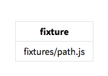

# Markdown It! plugin for YAML preambles

This plugin can turn fenced code blocks at the start of your markdown files into tables, replicating functionality from GitHub flavoured markdown, commonly required for static site generators such as Jekyll. Originally built for [Appraise](https://github.com/gojko/appraise).

Turns blocks like these:

```
---
fixture: fixtures/path.js
---
```

Into tables like this:



## Quick summary of features

* By default, renders a table with property names and values 
* Optionally adding a CSS class or marker HTML attributes to the table for easy identification
* Easily configurable to use different block markers
* Supports pluggable rendering, so you can easily display the results it differently
* Works with [js-yaml](https://github.com/nodeca/js-yaml), so it parses almost any valid YAML easily

## Status

Stable, production worthy, nicely unit tested. Tested with `js-yaml` 3.9.0 and `markdown-it` 8.3.1.


## Install

Grab it from NPM:

```bash
npm i markdown-it-github-preamble -S
```

## Usage

The plugin works the same way _Markdown It!_ plugins work, so just `.use` it:

```js
const Markdown = require('markdown-it'),
	markdownItGithubPreamble = require('markdown-it-github-preamble'),
  md = new Markdown().use(markdownItGithubPreamble);

console.log(md.render(
`---
propa: vala
propb: valb
---

abcd
`));
```

You can also supply additional options and customise the plugin:

```js
const Markdown = require('markdown-it'),
	markdownItGithubPreamble = require('markdown-it-github-preamble'),
  md = new Markdown().use(markdownItGithubPreamble, {className: 'preamble'});

console.log(md.render(
`---
propa: vala
propb: valb
---

abcd
`));
```


### Options

See the [unit tests](tests/markdown-it-github-preamble-spec.js) for examples of how to use all these options.

* `className`: (`string`) a CSS class that will be added to the root table element of the preamble, for easy styling. 
* `tableAttributeName` and `tableAttributeValue`: (`string`) the name and value of a HTML attribute that will be added to the root table element of the preamble, for easy identification in DOM parsers.
* `marker`: (`string`) the fence character identifying the YAML preamble block (by default, `'-'`)
* `render`: (`function`) a custom _Markdown It!_ rendered to use for turning the preamble tokens into HTML, instead of a table. 
* `name`: (`string`) internal identifier for the plugin, used as a prefix for tokens and renderers. Change it to avoid conflicts with other plugins using similar token names. By default, it's `preamble`

### License

MIT, see the [License](LICENSE)


